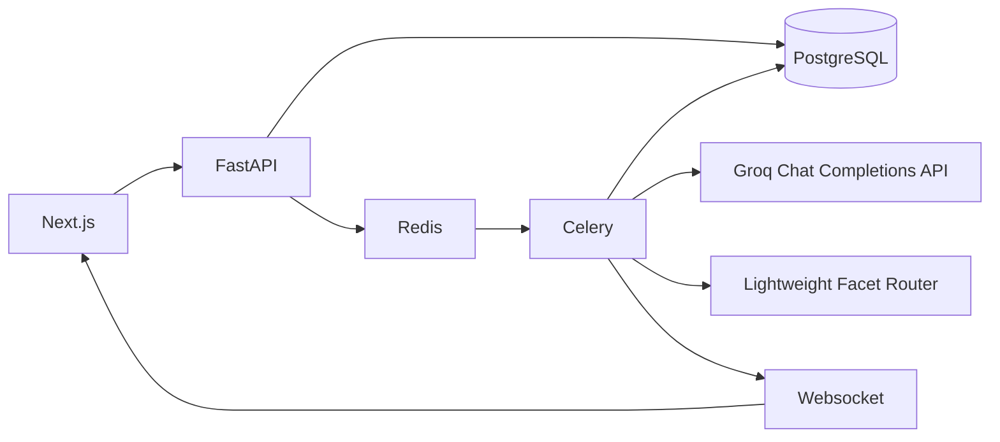
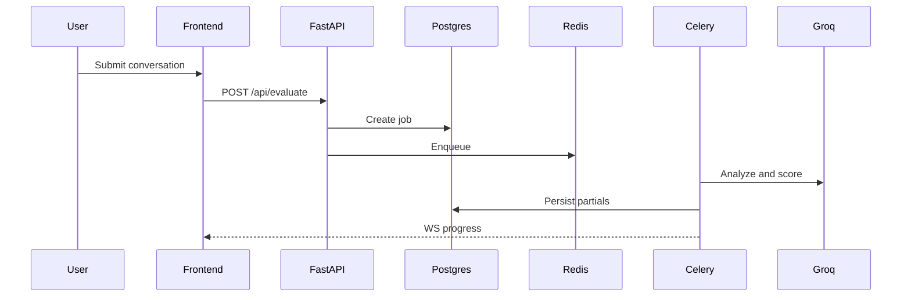
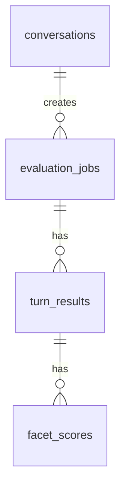

# Architecture

## Data Flow

## Sequence

## Database

## Routing Strategy

Stage 1 retrieves candidates with a lightweight lexical/hash scorer, filters observable facets, balances domains, and fills from the active registry until it reaches `MAX_ROUTER_FACETS` facets. The default is 300 scored facets per turn. This keeps the default Docker image small because it avoids PyTorch and sentence-transformers. An optional FAISS-compatible path remains available by installing `backend/requirements-optional-vector.txt` and setting `ROUTER_BACKEND=faiss`.

## Scoring Strategy

Stage 2 scores configurable batches of facets on -2..+2 and records reasoning plus critique adjustment metadata. For large registry runs above `LLM_SCORING_FACET_LIMIT`, it uses the deterministic local scorer so 300-facet evaluations do not stall on hosted API rate limits.

The LLM provider is `GroqClient`, which calls `https://api.groq.com/openai/v1/chat/completions` with `response_format={"type":"json_object"}` for strict JSON stages. The default model is `llama-3.1-8b-instant`, configured by `GROQ_MODEL`.

## Confidence Strategy

Stage 3 is enabled by default and repeats scoring at temperatures 0.8 and 1.1 to compute confidence, intervals, and agreement.

## Roadmap

Reviewer adjudication, calibration sets, tenant-specific facet registries, and cross-model ensembles.
